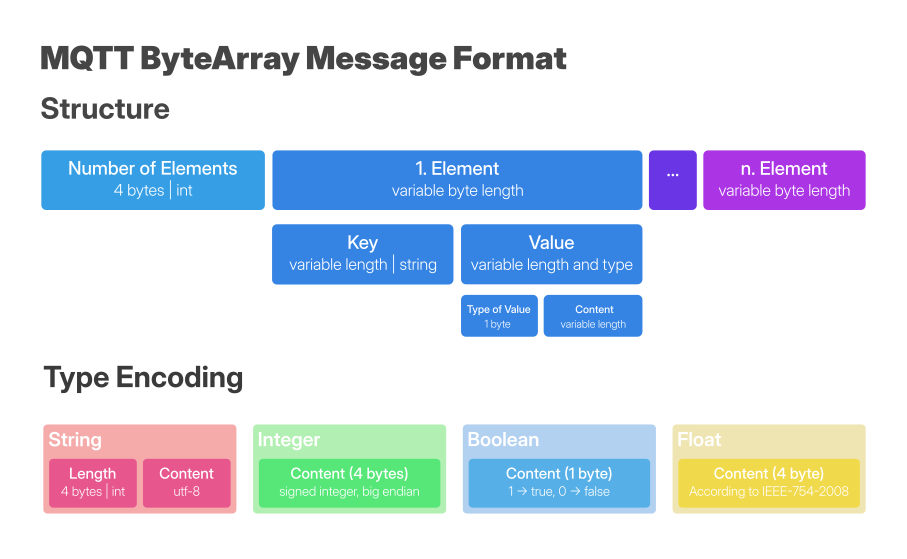

# Byte Encoding for the supported types
| ID/int/Bytecode | Type |
| ------ | ------ |
|    0    |    bool    |
|    1    |    string    |
|    2    |    int    |
|    3    |    float    |
|    4    |    null    |