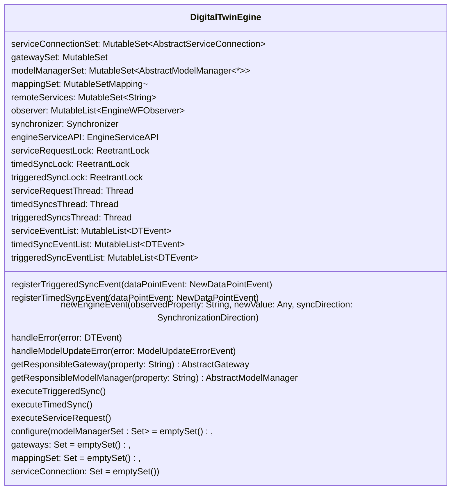
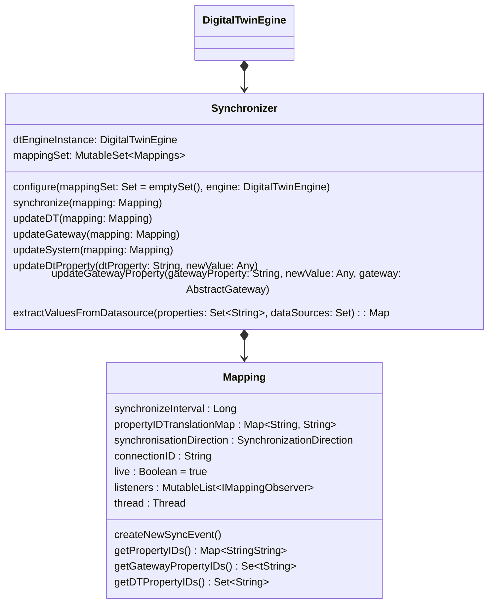

### Overview
The Digital Twin Engine (DTE) stands as the primary class within the Digital Twin System (DTS). It assumes responsibility for configuring the DTS, synchronizing properties between models and gateways, and executing the majority of events.  

The main purpose of this wiki page is to give insight into the synchronization of data. It is important to note that details regarding the `add` and `remove` functions for various collections within the DTE class are omitted here; please refer to the code for specific implementation details in that regard.

The DTE serves as the repository for instances of every Gateway (GW), Model Manager (MM), and service contributing to the DTS. It facilitates access to these instances for services and the Synchronizer, enabling actions in both Model Managers and Gateways, as well as synchronization. The Synchronizer assumes authority over all mappings and is accountable for orchestrating data synchronization between GW and MM. 

Another crucial responsibility undertaken by the DTE is the processing of incoming events. Given the complexity of this task, please refer to its dedicated [page](Event) for a more detailed exploration.




----


### Synchronization

For the synchronization of data between two data sources, namely GW and MM, two classes are essential, and they maintain a compositional relationship. These classes are the Mapping class and the Synchronizer class, with the Mapping class holding a subordinate role within this relationship.




#### Mapping

Mappings serve two purposes: firstly, they encapsulate the translation between MM property IDs and GW property IDs within the `propertyTranslationMap`; secondly, they have the capability to initiate timed synchronizations (for more information on events, please refer to [here](Event)).  


The property IDs within the `propertyTranslationMap` correspond to specific properties obtainable from a Model Manager (MM) or Gateway (GW). It's noteworthy that all properties within a given propertyTranslationMap share similar characteristics, which are crucial for synchronization. This commonality enables them to have the same synchronization interval, streamlining the coordination of synchronization activities for these properties. While this shared characteristic is fundamental for mappings used in timed synchronizations, it doesn't necessarily have to be the sole defining factor. 

For mappings exclusively employed in triggered synchronizations, the characteristics vary significantly based on the specific use case. This means the Deployer has to decide wich properties are important in the given context and should be synchronized, if a certain event is being thrown by a Gateway or Model Manager.   

Access to property IDs is facilitated through one of three methods: the `getGatewayPropertyIDs()` method, which returns all property IDs for the Gateways; the `getDTPropertyIDs()` method, which returns all property IDs for the Model Managers; and the "getPropertyIDs()" method, which returns the entire map, encompassing both sides. 

As part of the `synchronize` method within the Synchronizer class, one of these methods is invoked. This signifies that properties are updated exclusively through this process, implying that, as a consequence, all properties within a given `propertyTranslationMap` are either updated together or not updated at all.
 
Currently the property IDs are hardcoded within the main method as Strings, this is not ideal but serves its purpose, should be fixed some time. 


#### Synchronizer

The functionality of synchronizing is encapsulated in the Synchronizer class. The central function of the class resides in the `synchronize()` method, invoked each time the DTE initiates data synchronization between GW and MM. Notably, it synchronizes only one set of properties at a time, as determined by the mapping that holds the properties of that specific set in their `propertyTranslationMap`.   
Following an assessment of whether the liveliness status of the mapping permits synchronization, a private method is invoked to execute the synchronization based on the specified `SynchronizationDirection`.


````
    fun synchronize(mapping: Mapping) {
        if (!mapping.live) return
        when (mapping.synchronisationDirection){
            SynchronizationDirection.GATEWAY_TO_DT -> {
                updateDT(mapping)
            }
            SynchronizationDirection.DT_TO_GATEWAY -> {
                updateGateway(mapping)
            }
            SynchronizationDirection.BOTH -> {
                updateSystem(mapping)
            }
        }
    }
````


This enum is designed to indicate whether synchronization should occur unidirectionally, either from GW to MM or MM to GW, or bidirectionally. In the bidirectional mode, the most recent update of each property serves as the determining factor for deciding which entity, either GW or MM, should be updated.

For a better understanding of how synchronization with the mappings occurs, we will look at the `updateDT()` method. 


````
    private fun updateDT(mapping: Mapping) {
        try {
            val propertiesToUpdate = mapping.getGatewayPropertyIDs()
            val updateValuesFromGateway: Map<String, Any> = extractValuesFromDatasource(propertiesToUpdate, dtEngineInstance.gatewaySet)
            mapping.propertyIDTranslationMap.forEach { (dtProperty, gatewayProperty) ->
                val newValue = updateValuesFromGateway[gatewayProperty]!!
                updateDtProperty(dtProperty, newValue)
            }
        } catch(e: Exception) {
            dts.logger.error { e.message }
        }

    }
````

As previously mentioned, the mapping holds the set of properties slated for updating. This set is passed to the `extractValuesFromDatasource()` method, which performs two primary tasks.  

Firstly, it searches for all gateways responsible for at least one property in the specified set. Secondly, it compiles and stores the properties with their latest values from the gateway in a map, which is subsequently returned. 
  
After this step, we proceed with an iteration through the translation map, presenting each property individually alongside its corresponding value to the `updateDtProperty()` method.     
Subsequently, this function searches for the accountable MM for each property and concurrently updates its value. The methods `updateGateway()` and `updateGatewayProperty()` follow a parallel approach.


Now, considering the slightly different approach applied in bidirectional synchronization, let's undertake a more detailed exploration of this particular process:   
In this scenario, the search for new property values is not restricted exclusively to either the MM or GW.   

Instead, we identify the responsible MM and GW for each pair of corresponding property IDs in the property translation map of the mapping Simultaneously, we retrieve their respective latest update times. Following this, these update time values are compared, and the data source with the later update time for the given property has its value overwritten with the more recent value.

 

````
    private fun updateSystem(mapping: Mapping) {
        val propertyTranslationMap = mapping.getPropertyIDs()
        propertyTranslationMap.forEach { (dtProperty, cpsProperty) ->
            val gateway = dtEngineInstance.getResponsibleGateway(cpsProperty)
            val lastGatewayUpdate = gateway.getLastUpdate(cpsProperty)
            val modelManager = dtEngineInstance.getResponsibleModelManager(dtProperty)
            val lastDTUpdate = modelManager.getLastUpdate(dtProperty)
            //TODO: add error handling and better condition checking
            if (lastDTUpdate == "0" && lastGatewayUpdate == "0")
                return
            if (lastDTUpdate > lastGatewayUpdate!!) {
                val newValue = modelManager.getValue(dtProperty)
                if (newValue != null) updateGatewayProperty(cpsProperty, newValue, gateway)
            } else {
                val newValue = gateway.getValue(cpsProperty)
                if (newValue != null) updateDtProperty(dtProperty, newValue)
            }
        }
    }
````

This concludes the comprehensive overview of the functionality of how data is synchronized between GW, MM and vice versa.

Moving forward, we will look at how the synchronization is initiated within the DTE.