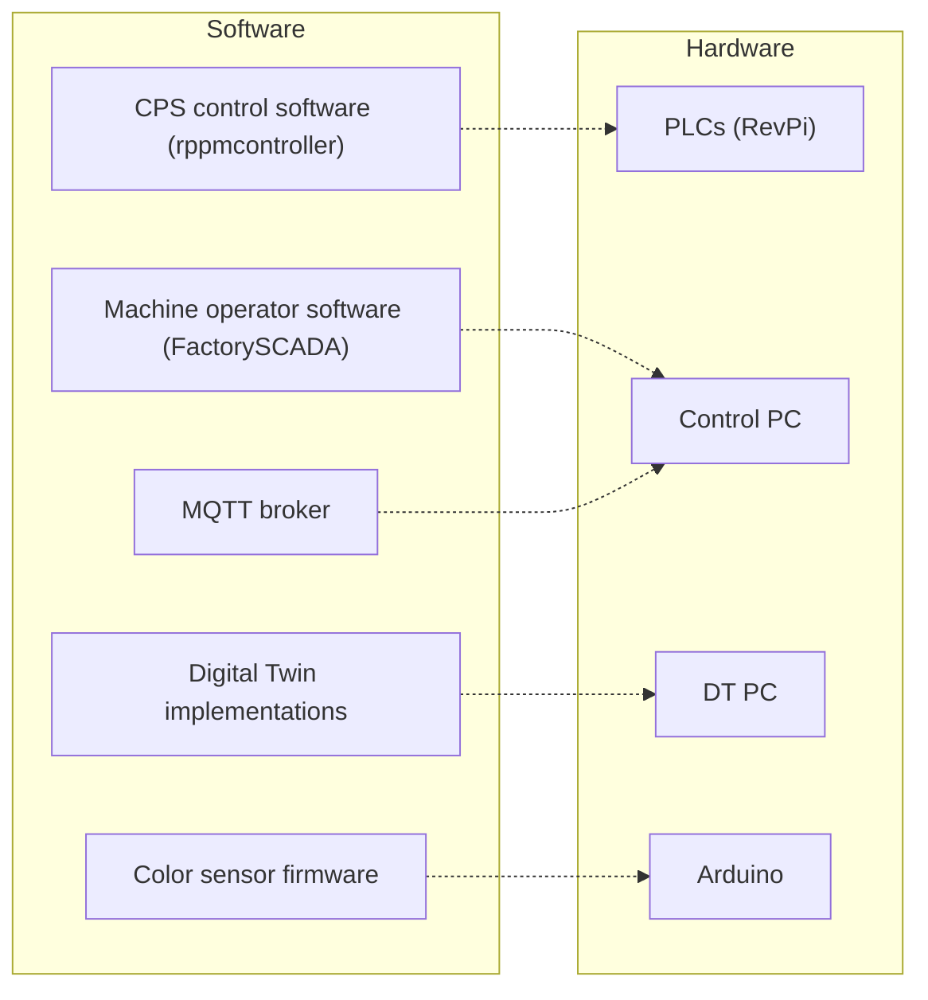

# Software and hardware allocation

This document groups the available software by purpose and shows on which machine it runs.
The software is split among different repositories of the [edt-edu](https://github.com/edt-edu) organization:

| Subproject | Contents |
| --- | --- |
| `cps-fischertechnik` | RevPi controller framework, FactorySCADA, Arduino firmware, hardware drawings, and cps reference material. |
| `dt-platform` | Shared data gateway, SVG map generator, and additional Digital Twin implementations. |
| `dt-setups` | Site-specific controller entry points, I/O mappings, service configurations, and deployment scripts. |
| `DT-Use-Cases` | UC1 energy monitoring, UC2 replanning, and UC3 predictive maintenance implementations. |

## Allocation figure

Dashed arrows show which hardware runs each software group.

Note: The `Control PC` and `DT PC` can be the same machine, which simplifies the deployment.
If the Digital Twins are computationally intensive, it makes sense to have two machines instead.

## Software allocation

| Software | Hardware | Purpose |
| --- | --- | --- |
| CPS control software (`rppmcontroller`) | PLCs (RevPi) | Controls machine sensors and actuators through the DIO modules. |
| Machine operator software (FactorySCADA) | Control PC | Provides the operator interface and coordinates machine missions. |
| MQTT broker (Mosquitto) | Control PC | Exchanges machine events and Digital Twin data. |
| Digital Twin implementations | DT PC | Runs UC1 energy monitoring, UC2 replanning, UC3 predictive maintenance, and additional Digital Twins. |
| Color sensor firmware | Arduino | Converts analog sensor readings, classifies colors, and controls LEDs on the sorting line. |
